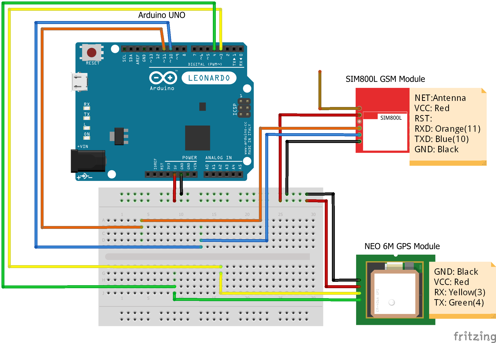

# IOT-child-location-tracker
This is a miniproject in IOT that helps the parents to track their kid while he/she is away from them.

Hardware Requirements:
1.Arduino UNO
2.NEO-6M GPS module
3.SIM 800l GSM module
4.Breadboard
5.Jumper wires

Software Requirements:
Arduino Program Editor
https://create.arduino.cc/editor
